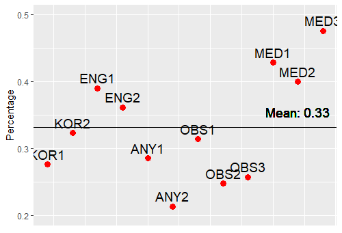
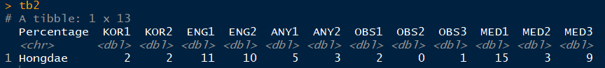

# LCK
POG votes in LCK

LCK_R1.zip file has raw data of total 105 games in LCK Round1. 
Converted the above data into a csv file is saved as LCK_R1.csv.

After each game, 12 voters(KOR1,2, ENG1,2, ANY1,2, OBS1,2,3, MED1,2,3) vote who was the player of the game(POG). 
(KOR(Korean commentators), ENG(English commentators), ANY(Analysts), OBS(Observers), MED(Media)) 
Among 5 positions(TOP, JG, MID, BOT, SUP), the player who got the most votes becomes the POG. 
If a tie occurs, casting votes system activates, ANY1,2, OBS1 have the rights to vote.

2 Ways of analyzing this data.

1. Incorrect Rate

How badly 'each voters' did the vote? 
For example, KOR1 voted for JG, KOR2 voted for MID. Elected POG was the MID. 
Then KOR1 gets Wrong point +1, KOR2 gets Correct point +1

You can see that ENG1,2, MED1,2,3 got higher incorrect rates than others.

___

2. Hongdae Score

Each voter gets "Hongdae score" when no other voters voted the player he or she voted. 
i.e. If KOR1 is the only one who voted for JG, whereas other 11 voters voted for MID, KOR1 gets +1 Hongdae score.

You can see that ENG1,2, MED1,3 got much higher Hongdae scores than others.

LCK_R1.R file has the source code for these.
